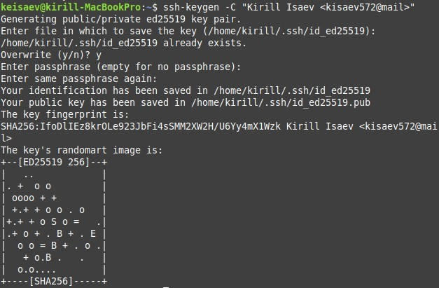

---
## Front matter
title: "Отчёт по лабораторной работе 2"
subtitle: "Архитектура компьютера"
author: "Исаев Кирилл НБИбд-01-24"

## Generic otions
lang: ru-RU
toc-title: "Содержание"

## Bibliography
bibliography: bib/cite.bib
csl: pandoc/csl/gost-r-7-0-5-2008-numeric.csl

## Pdf output format
toc: true # Table of contents
toc-depth: 2
lof: true # List of figures
lot: true # List of tables
fontsize: 12pt
linestretch: 1.5
papersize: a4
documentclass: scrreprt
## I18n polyglossia
polyglossia-lang:
  name: russian
  options:
	- spelling=modern
	- babelshorthands=true
polyglossia-otherlangs:
  name: english
## I18n babel
babel-lang: russian
babel-otherlangs: english
## Fonts
mainfont: PT Serif
romanfont: PT Serif
sansfont: PT Sans
monofont: PT Mono
mainfontoptions: Ligatures=TeX
romanfontoptions: Ligatures=TeX
sansfontoptions: Ligatures=TeX,Scale=MatchLowercase
monofontoptions: Scale=MatchLowercase,Scale=0.9
## Biblatex
biblatex: true
biblio-style: "gost-numeric"
biblatexoptions:
  - parentracker=true
  - backend=biber
  - hyperref=auto
  - language=auto
  - autolang=other*
  - citestyle=gost-numeric
## Pandoc-crossref LaTeX customization
figureTitle: "Рис."
tableTitle: "Таблица"
listingTitle: "Листинг"
lofTitle: "Список иллюстраций"
lotTitle: "Список таблиц"
lolTitle: "Листинги"
## Misc options
indent: true
header-includes:
  - \usepackage{indentfirst}
  - \usepackage{float} # keep figures where there are in the text
  - \floatplacement{figure}{H} # keep figures where there are in the text
---

# Цель работы

Целью работы является изучить идеологию и применение средств контроля версий. Приобрести практические навыки по работе с системой git.

# Выполнение лабораторной работы

Сначала сделаю предварительную конфигурацию git. Открываю терминал и ввожу следующие команды, указав имя и email владельца репозитория:

{ #fig:001 width=70%, height=70% }

Настраиваю utf-8 в выводе сообщений git:

{ #fig:002 width=70%, height=70% }

Задаю имя начальной ветки (будем называть её master)

{ #fig:003 width=70%, height=70% }

Ввожу параметр autocrlf и параметр safecrlf

{ #fig:004 width=70%, height=70% }

Для последующей идентификации пользователя на сервере репозиториев необходимо сгенерировать пару ключей (приватный и открытый)

{ #fig:005 width=70%, height=70% }

Теперь я создаю рабочий каталог и клонирую туда репозиторий с гитхаба.

{ #fig:006 width=70%, height=70% }

После генерации ключа, загружаю открытый ключ, скопировав из локальной консоли в буфер обмена. Вставляю ключ в появившееся на сайте поле и указываю для ключа имя (Title).

{ #fig:007 width=70%, height=70% }

{ #fig:008 width=70%, height=70% }

Открываю терминал и создаю каталог для предмета «Архитектура компьютеров»

{ #fig:009 width=70%, height=70% }

Открываю терминал и захожу в каталог курса. Клонирую созданный репозиторий. 

{ #fig:010 width=70%, height=70% }

Перехожу в каталог курса.

{ #fig:011 width=70%, height=70% }

Удаляю лишние файлы и создаю необходимые каталоги.

{ #fig:012 width=70%, height=70% }

Отправляю файлы на сервер

{ #fig:013 width=70%, height=70% }

{ #fig:014 width=70%, height=70% }

Проверяю правильность создания иерархии рабочего пространства в локальном репозитории и на странице github

{ #fig:015 width=70%, height=70% }

# Выводы

В ходе выполнения работы изучили работу с GitHub.
