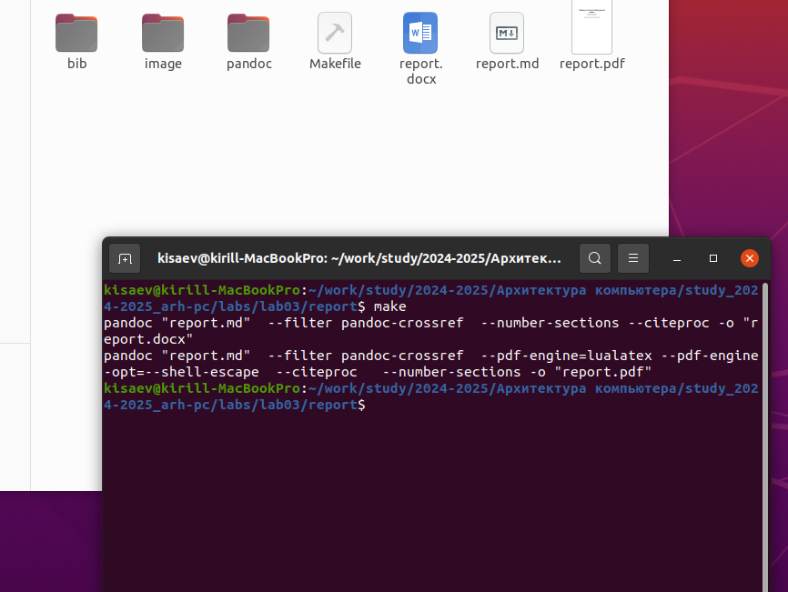
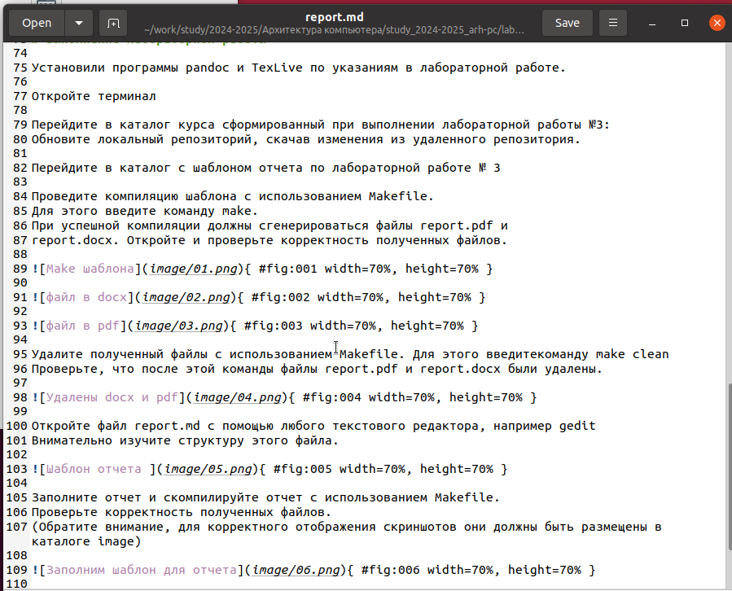
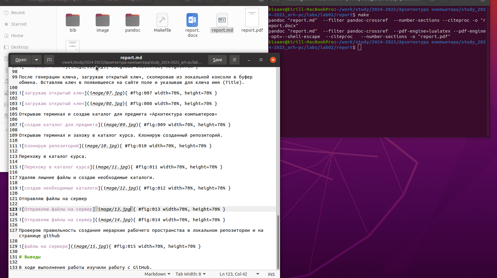

---
## Front matter
title: "Отчёт по лабораторной работе 3"
subtitle: "Архитектура компьютера"
author: "Исаев Кирилл НБИбд-01-24"

## Generic otions
lang: ru-RU
toc-title: "Содержание"

## Bibliography
bibliography: bib/cite.bib
csl: pandoc/csl/gost-r-7-0-5-2008-numeric.csl

## Pdf output format
toc: true # Table of contents
toc-depth: 2
lof: true # List of figures
lot: true # List of tables
fontsize: 12pt
linestretch: 1.5
papersize: a4
documentclass: scrreprt
## I18n polyglossia
polyglossia-lang:
  name: russian
  options:
	- spelling=modern
	- babelshorthands=true
polyglossia-otherlangs:
  name: english
## I18n babel
babel-lang: russian
babel-otherlangs: english
## Fonts
mainfont: PT Serif
romanfont: PT Serif
sansfont: PT Sans
monofont: PT Mono
mainfontoptions: Ligatures=TeX
romanfontoptions: Ligatures=TeX
sansfontoptions: Ligatures=TeX,Scale=MatchLowercase
monofontoptions: Scale=MatchLowercase,Scale=0.9
## Biblatex
biblatex: true
biblio-style: "gost-numeric"
biblatexoptions:
  - parentracker=true
  - backend=biber
  - hyperref=auto
  - language=auto
  - autolang=other*
  - citestyle=gost-numeric
## Pandoc-crossref LaTeX customization
figureTitle: "Рис."
tableTitle: "Таблица"
listingTitle: "Листинг"
lofTitle: "Список иллюстраций"
lotTitle: "Список таблиц"
lolTitle: "Листинги"
## Misc options
indent: true
header-includes:
  - \usepackage{indentfirst}
  - \usepackage{float} # keep figures where there are in the text
  - \floatplacement{figure}{H} # keep figures where there are in the text
---

# Цель работы

Целью работы является освоение процедуры оформления отчетов с помощью легковесного языка разметки Markdown.

# Выполнение лабораторной работы

Установили программы pandoc и TexLive по указаниям в лабораторной работе. 

Откройте терминал

Перейдите в каталог курса сформированный при выполнении лабораторной работы №3:
Обновите локальный репозиторий, скачав изменения из удаленного репозитория.

Перейдите в каталог с шаблоном отчета по лабораторной работе № 3

Проведите компиляцию шаблона с использованием Makefile. 
Для этого введите команду make.
При успешной компиляции должны сгенерироваться файлы report.pdf и
report.docx. Откройте и проверьте корректность полученных файлов. 

{ #fig:001 width=70%, height=70% }

{ #fig:002 width=70%, height=70% }

{ #fig:003 width=70%, height=70% }

Удалите полученный файлы с использованием Makefile. Для этого введитекоманду make clean
Проверьте, что после этой команды файлы report.pdf и report.docx были удалены.

{ #fig:004 width=70%, height=70% }

Откройте файл report.md c помощью любого текстового редактора, например gedit
Внимательно изучите структуру этого файла.

{ #fig:005 width=70%, height=70% }

Заполните отчет и скомпилируйте отчет с использованием Makefile. 
Проверьте корректность полученных файлов.
(Обратите внимание, для корректного отображения скриншотов они должны быть размещены в каталоге image)

{ #fig:006 width=70%, height=70% }

Заполним отчет по 2 лабораторной. 

{ #fig:007 width=70%, height=70% }

# Выводы

Изучили синтаксис языка разметки Markdown, получили отчет из шаблона при помощи Makefile. 

