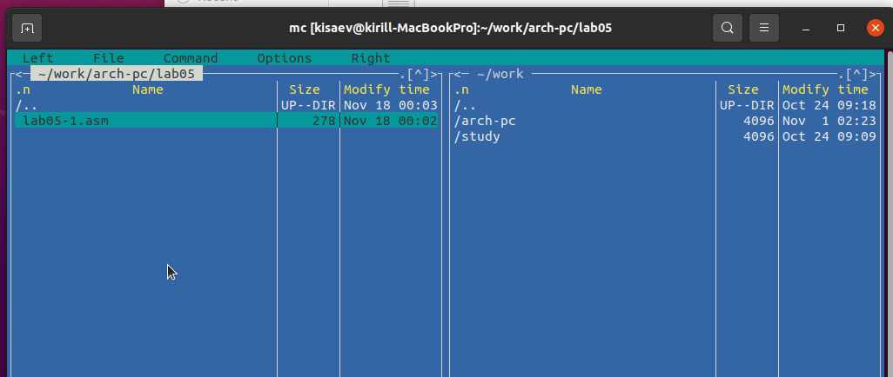

---
## Front matter
title: "Отчёт по лабораторной работе 5"
subtitle: "Архитектура компьютера"
author: "Исаев Кирилл НБИбд-01-24"

## Generic otions
lang: ru-RU
toc-title: "Содержание"

## Bibliography
bibliography: bib/cite.bib
csl: pandoc/csl/gost-r-7-0-5-2008-numeric.csl

## Pdf output format
toc: true # Table of contents
toc-depth: 2
lof: true # List of figures
lot: true # List of tables
fontsize: 12pt
linestretch: 1.5
papersize: a4
documentclass: scrreprt
## I18n polyglossia
polyglossia-lang:
  name: russian
  options:
	- spelling=modern
	- babelshorthands=true
polyglossia-otherlangs:
  name: english
## I18n babel
babel-lang: russian
babel-otherlangs: english
## Fonts
mainfont: PT Serif
romanfont: PT Serif
sansfont: PT Sans
monofont: PT Mono
mainfontoptions: Ligatures=TeX
romanfontoptions: Ligatures=TeX
sansfontoptions: Ligatures=TeX,Scale=MatchLowercase
monofontoptions: Scale=MatchLowercase,Scale=0.9
## Biblatex
biblatex: true
biblio-style: "gost-numeric"
biblatexoptions:
  - parentracker=true
  - backend=biber
  - hyperref=auto
  - language=auto
  - autolang=other*
  - citestyle=gost-numeric
## Pandoc-crossref LaTeX customization
figureTitle: "Рис."
tableTitle: "Таблица"
listingTitle: "Листинг"
lofTitle: "Список иллюстраций"
lotTitle: "Список таблиц"
lolTitle: "Листинги"
## Misc options
indent: true
header-includes:
  - \usepackage{indentfirst}
  - \usepackage{float} # keep figures where there are in the text
  - \floatplacement{figure}{H} # keep figures where there are in the text
---

# Цель работы

Целью работы является приобретение практических навыков работы в Midnight Commander. 
Освоение инструкций языка ассемблера mov и int.

# Выполнение лабораторной работы

Открыл Midnight Commander, с помощью клавиш со стрелками и Enter перешел в каталог `~/work/arch-pc`.
Далее нажал F7 и создал каталог `lab05`.

{ #fig:001 width=70%, height=70% }

С помощью команды `touch` создал файл `lab05-1.asm`.

{ #fig:002 width=70%, height=70% }

Открыл файл для редактирования с помощью клавиши F4, выбрал редактор `mceditor`, 
и ввел код программы из задания.

{ #fig:003 width=70%, height=70% }

Проверил содержимое файла, открыв его на просмотр клавишей F3. Убедился, что в файле находится введенный код.

{ #fig:004 width=70%, height=70% }

Скомпилировал файл программы в объектный файл, выполнил компоновку и получил исполняемый файл программы. Проверил её работу.

{ #fig:005 width=70%, height=70% }

Для упрощения разработки программ, часто используемые участки кода, такие как вывод строки на экран или завершение программы, можно оформить в виде подпрограмм и сохранить в отдельные файлы. Это делает основную программу более компактной и удобной для чтения и модификации.

Скачал файл `in_out.asm` и разместил его в рабочем каталоге. Для копирования файла использовал клавишу F5, а для перемещения — F6.

Скопировал файл `lab05-1.asm` в новый файл `lab05-2.asm`.

{ #fig:006 width=70%, height=70% }

Написал код программы `lab05-2.asm`, использовав подпрограммы из внешнего файла `in_out.asm`.

{ #fig:007 width=70%, height=70% }

{ #fig:008 width=70%, height=70% }

В файле `lab05-2.asm` заменил подпрограмму `sprintLF` на `sprint`. Заново собрал исполняемый файл. После изменений строки выводятся без символа перехода на новую строку.

{ #fig:009 width=70%, height=70% }

{ #fig:010 width=70%, height=70% }

Скопировал программу `lab05-1.asm` и изменил её код так, чтобы программа выполняла следующие действия:

* выводила приглашение: *"Введите строку:"*;
* считывала строку с клавиатуры;
* выводила введённую строку на экран.

{ #fig:011 width=70%, height=70% }

{ #fig:012 width=70%, height=70% }

Аналогично, скопировал программу `lab05-2.asm` и изменил её код, чтобы программа использовала подпрограммы из файла `in_out.asm`.

{ #fig:017 width=70%, height=70% }

{ #fig:018 width=70%, height=70% }

# Выводы

Научились писать базовые ассемблерные программы. Освоили ассемблерные инструкции mov и int.
