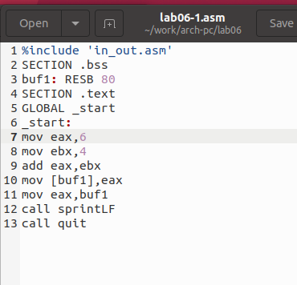

---
## Front matter
title: "Отчёт по лабораторной работе 6"
subtitle: "Архитектура компьютера"
author: "Исаев Кирилл НБИбд-01-24"

## Generic otions
lang: ru-RU
toc-title: "Содержание"

## Bibliography
bibliography: bib/cite.bib
csl: pandoc/csl/gost-r-7-0-5-2008-numeric.csl

## Pdf output format
toc: true # Table of contents
toc-depth: 2
lof: true # List of figures
lot: true # List of tables
fontsize: 12pt
linestretch: 1.5
papersize: a4
documentclass: scrreprt
## I18n polyglossia
polyglossia-lang:
  name: russian
  options:
	- spelling=modern
	- babelshorthands=true
polyglossia-otherlangs:
  name: english
## I18n babel
babel-lang: russian
babel-otherlangs: english
## Fonts
mainfont: PT Serif
romanfont: PT Serif
sansfont: PT Sans
monofont: PT Mono
mainfontoptions: Ligatures=TeX
romanfontoptions: Ligatures=TeX
sansfontoptions: Ligatures=TeX,Scale=MatchLowercase
monofontoptions: Scale=MatchLowercase,Scale=0.9
## Biblatex
biblatex: true
biblio-style: "gost-numeric"
biblatexoptions:
  - parentracker=true
  - backend=biber
  - hyperref=auto
  - language=auto
  - autolang=other*
  - citestyle=gost-numeric
## Pandoc-crossref LaTeX customization
figureTitle: "Рис."
tableTitle: "Таблица"
listingTitle: "Листинг"
lofTitle: "Список иллюстраций"
lotTitle: "Список таблиц"
lolTitle: "Листинги"
## Misc options
indent: true
header-includes:
  - \usepackage{indentfirst}
  - \usepackage{float} # keep figures where there are in the text
  - \floatplacement{figure}{H} # keep figures where there are in the text
---

# Цель работы

Целью работы является освоение арифметических инструкций языка ассемблера NASM.

# Выполнение лабораторной работы

## Символьные и численные данные в NASM

Создал каталог для программ лабораторной работы №6, перешел в него и создал файл с названием "lab6-1.asm".

Рассмотрим примеры программ вывода символьных и численных значений. Программы выводят значения, записанные в регистр `eax`.

В данной программе в регистр `eax` записан символ `'6'`, а в регистр `ebx` символ `'4'`. Затем прибавляем значение регистра `ebx` к значению в регистре `eax` (результат сложения записывается в `eax`). После этого выводим результат.

Так как для работы функции `sprintLF` в регистр `eax` должен быть записан адрес, используется дополнительная переменная. Значение регистра `eax` записывается в переменную `buf1`, затем адрес переменной `buf1` записывается в регистр `eax`, и вызывается функция `sprintLF`.

{ #fig:001 width=70%, height=70% }

{ #fig:002 width=70%, height=70% }

При выводе значения регистра `eax` ожидалось число `10`. Однако результатом оказался символ `'j'`. Это произошло из-за сложения кодов символов `'6'` (54 в десятичном представлении) и `'4'` (52). Команда `add eax, ebx` записала сумму кодов — 106, что является кодом символа `'j'`.

Далее текст программы изменен, вместо символов записаны числа.

{ #fig:003 width=70%, height=70% }

{ #fig:004 width=70%, height=70% }

При выполнении программы вместо ожидаемого числа `10` был выведен символ с кодом `10`, который соответствует символу возврата каретки (пустая строка в консоли).

В файле `in_out.asm` реализованы подпрограммы для работы с числами и преобразования символов ASCII. Текст программы был модифицирован с использованием этих функций.

{ #fig:005 width=70%, height=70% }

{ #fig:006 width=70%, height=70% }

Обновленная программа вывела число `106`. Здесь команда `add` складывает коды символов `'6'` и `'4'`. Благодаря функции `iprintLF` было выведено именно число, а не символ с кодом `106`.

По аналогии символы заменены на числа.

{ #fig:007 width=70%, height=70% }

Функция `iprintLF` позволила вывести число `10`. На этот раз операндами выступали непосредственно числа, а не коды символов.

{ #fig:008 width=70%, height=70% }

Функция `iprintLF` была заменена на `iprint`, создан исполняемый файл и запущен. Вывод теперь отличается отсутствием перехода на новую строку.

{ #fig:009 width=70%, height=70% }

{ #fig:010 width=70%, height=70% }

## Выполнение арифметических операций в NASM

Пример: вычисление выражения $$f(x) = (5 * 2 + 3) / 3$$.

{ #fig:011 width=70%, height=70% }

{ #fig:012 width=70%, height=70% }

Изменен текст программы для выражения $$f(x) = (4 * 6 + 2) / 5$$, создан исполняемый файл, проведена проверка.

{ #fig:013 width=70%, height=70% }

{ #fig:014 width=70%, height=70% }

Еще один пример: вычисление варианта задания на основе номера студенческого билета. Число вводится с клавиатуры и преобразуется из символов в число с помощью функции `atoi`.

{ #fig:015 width=70%, height=70% }

{ #fig:016 width=70%, height=70% }

### Ответы на вопросы по программе variant.asm

1. **Какие строки листинга отвечают за вывод сообщения "Ваш вариант:"?**  
   Строки с инструкцией `mov eax, rem` и вызовом `call sprint`.

2. **Для чего используется `mov ecx, x`?**  
   Для сохранения значения переменной `x` в регистре `ecx`.

3. **Для чего используется `call atoi`?**  
   Для преобразования введенных символов в числовой формат.

4. **Какие строки отвечают за вычисление варианта?**  
   - `xor edx, edx`  
   - `mov ebx, 20`  
   - `div ebx`  
   - `inc edx`

5. **Где записывается остаток от деления при выполнении `div ebx`?**  
   Остаток записывается в регистр `edx`.

6. **Для чего используется `inc edx`?**  
   Для увеличения значения `edx` на 1, что соответствует формуле вычисления варианта.

7. **Какие строки отвечают за вывод результата вычислений?**  
   - `mov eax, edx`  
   - `call iprintLF`

## Выполнение заданий для самостоятельной работы

Написал программу для вычисления выражения $$y = f(x)$$. 
Программа запрашивает значение `x`, вычисляет выражение 
и выводит результат. 

Использован вариант 3: $$(2 + x)^2$$ для $x = 2$ и $x = 8$.

{ #fig:017 width=70%, height=70% }

{ #fig:018 width=70%, height=70% }

Программа корректно выполняет расчет.

# Выводы

Изучил работу с арифметическими операциями в NASM.
